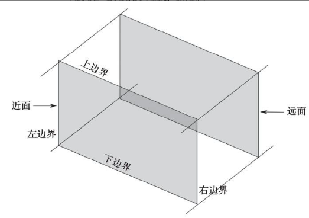
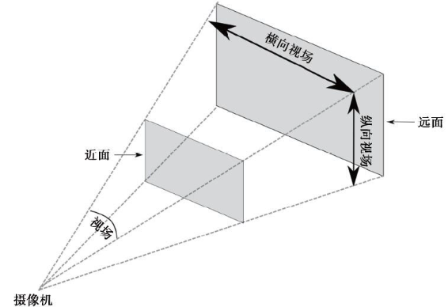

# 场景

> author:hqx

## 场景对象属性和方法

场景中包含了多个物体，光源等对象，scene 将其按照添加顺序维护成一个数组，即新添加的对象在数组尾部，scene 提供了一些基本方法或属性供我们获取并操控场景中的对象：

- THREE.Scene.Add：用于向场景中添加对象
- THREE.Scene.Remove：用于移除场景中的对象
- THREE.Scene.children（属性）：用于获取场景中所有的子对象列表
- THREE.Scene.getObjectByName：利用 name 属性，用于获取场景中特定的对象
- THREE.Scene.traverse：接收一个 function，其会完全遍历 scene 中的所有子对象，并在其基础上执行该 function
- THREE.Scene.overrideMaterial（属性）：此属性为场景内所有物体设置材质，物体自身材质会被覆盖掉，以此来统一材质

## 场景属性方法

场景还具有一系列的属性和方法来改变自身的性质，示例中介绍了 fog 雾化属性：

- THREE.Scene.fog（属性）：通过`new THREE.Fog(color, far, near)`来为场景设置雾化效果，三个参数分别是雾化颜色，最远处雾化程度，最近处雾化程度

# 几何体和网格

## 几何体

在 three.js 中，几何体是构成某些对象的基础（另一个基础是材质），其由顶点的点集组成，再由点集中的点构成三角形的面，终止形成几何体。几何体的构成思想同 webGL 中的顶点着色器用法，一个几何体的位置信息是由顶点集组成的矩阵来声明的。

### 点

单个顶点由`new THREE.Vector3（x,y,z）`进行声明，其三个参数代表了其控件中的坐标。

### 面

单个面可由`new THREE.Face3（vec1,vec2,vec3）`进行声明，其三个参数代表了三个顶点对象，即三个点形成一个三角形基本面，且点集具有位置顺序之分，顶点顺序为顺时针则面向摄像机，逆时针则背对摄像机。

### 创建一个几何体

three.js 中创建几何体有三种方法：

- 使用 three.js 提供的基本几何体类型，无需声明点集，直接通过几何体属性（诸如长宽高等），由 three.js 自动创建
- 使用自定义的点集和面集，声明一个空的几何体，将点集和面集赋予它，再调用 computeFaceNormals 生成几何体，步骤如下：
  ```
    var geom = new THREE.Geometry();
    geom.vertices = vertices;
    geom.faces = faces;
    geom.computeFaceNormals();
  ```
- 使用`geometry.clone()`方法来复制几何体
- 其余方法待补充

## 网格

截至到这一章，我们所创建的场景内的物体，均是网格对象 Mesh，其由一个几何体和一个或多个材质构成。网格对象的特点是其基是于三角形的多边形网格的类，也是其它物体的基类，其创建方法前面的示例我们已经见过多次：

```
const geometry = new THREE.BoxGeometry( 1, 1, 1 );
const material = new THREE.MeshBasicMaterial( { color: 0xffff00 } );
const mesh = new THREE.Mesh( geometry, material );
scene.add( mesh );
```

网格对象还具有以下属性和方法：

- position：决定该对象相对于父对象的位置
- rotation：设置绕每个轴旋转的角度
- scale：将对象沿着 x,y,z 轴进行缩放
- visible：是否可见，不可见的对象不会被渲染
- translateX()：将对象沿 X 轴平移
- translateX()：将对象沿 Y 轴平移
- translateX()：将对象沿 Z 轴平移，当场景中由轴 Axis 时，可以使用 translateOnAxis（axis，distance）来平移

# 摄像机

摄像机的位置决定了页面渲染的内容和你能看到的东西，这里介绍three.js 提供的两种基本摄像机：`正交摄像机`和`透视摄像机`。three.js还有一些为 VR 额外准备的摄像机，以及新版本的立方相机，立体相机等。

## 正交摄像机

在使用正交摄像机进行投影时，无论物体距离摄像机远还是近，最终渲染到页面的大小都是不变的，这种渲染模式十分适用于 2D 场景或者 UI 元素。正交摄像机`new THREE.OrthographicCamera(...arg)`进行创建，其按先后顺序分别接收以下参数来定义视锥体：

- left — 摄像机视锥体左侧面，渲染范围的左边界
- right — 摄像机视锥体右侧面，渲染范围的右边界
- top — 摄像机视锥体上侧面，渲染范围的上界
- bottom — 摄像机视锥体下侧面，渲染范围的下届
- near — 摄像机视锥体近端面，即摄像机所处的位置，从这一面开始渲染
- far — 摄像机视锥体远端面，即超过这个面的部分不会被渲染

正交摄像机的视锥体其实就是如下的立方体：  


## 透视摄像机

透视摄像机的投影方式和我们日常的视觉投影方式是相同的，即遵循着近大远小的透视准则，其视锥体为一个四棱锥形。透视摄像机采用`new THREE.PerspectiveCamera(...arg)`进行创建，其创建参数和正交摄像机不同，按先后顺序分别接收以下参数来定义视锥体：

- fov：摄像机视锥体垂直视野角度，视野角度越大，能看到的东西越多，可理解为摄像机中的广角
- aspect：摄像机视锥体长宽比
- near：摄像机视锥体近端面，从此面开始渲染
- far：摄像机视锥体远端面，到此面结束渲染

同样地，透视摄像机也具有以下视锥体：


## 设置摄像机焦点

3D 场景中的一些动效，除了对象自身位置的改变，还可以通过改变摄像机的位置来实现，通过`camera.lookAt()`来设置相机的位置，其接收一个`new Three.Vector3(x,y,z)`顶点对象。所以当你需要聚焦场景内的某个对象时，将相机位置设置为改对象的位置即可，例如

```
camera.lookAt(mesh.position)
```

